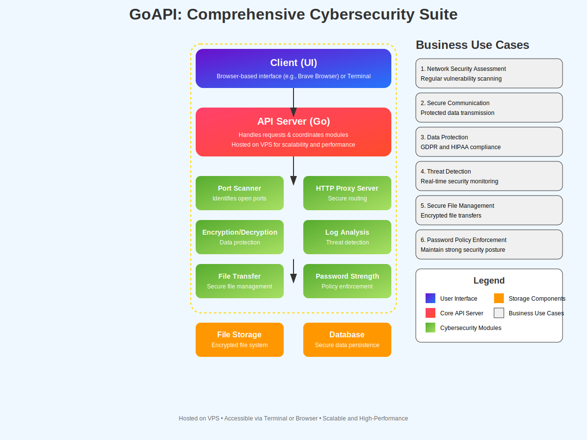

# goapi


## Table of Contents

- [Introduction](#introduction)
- [Features](#features)
- [Business Use Cases](#business-use-cases)
  - [1. Network Security Assessment](#1-network-security-assessment)
  - [2. Secure Communication](#2-secure-communication)
  - [3. Data Protection](#3-data-protection)
  - [4. Threat Detection](#4-threat-detection)
  - [5. Secure File Management](#5-secure-file-management)
  - [6. Password Policy Enforcement](#6-password-policy-enforcement)
- [Installation](#installation)
  - [Prerequisites](#prerequisites)
  - [Steps](#steps)
- [Usage](#usage)
  - [1. Simple Port Scanner](#1-simple-port-scanner)
  - [2. HTTP Proxy Server](#2-http-proxy-server)
  - [3. Encryption/Decryption Utility](#3-encryptiondecryption-utility)
  - [4. Log Analysis Tool](#4-log-analysis-tool)
  - [5. Secure File Transfer Tool](#5-secure-file-transfer-tool)
  - [6. Password Strength Analyzer](#6-password-strength-analyzer)
- [Project Structure](#project-structure)
- [Adding and Styling Images](#adding-and-styling-images)
- [Contributing](#contributing)
- [License](#license)
- [Contact](#contact)

## Introduction

**goapi** is a monolithic Go-based API platform designed to provide a suite of essential cybersecurity tools. Built with scalability and performance in mind, **goapi** integrates multiple utilities into a single, cohesive application, streamlining cybersecurity operations for businesses of all sizes.



## Features

- **Simple Port Scanner**: Efficiently scans open ports on target hosts to identify potential vulnerabilities.
- **HTTP Proxy Server**: Facilitates secure and anonymous browsing by routing HTTP requests through the proxy.
- **Encryption/Decryption Utility**: Provides robust encryption and decryption functionalities to protect sensitive data.
- **Log Analysis Tool**: Analyzes server logs to identify suspicious activities and potential security breaches.
- **Secure File Transfer Tool**: Enables secure uploading and downloading of files with encryption.
- **Password Strength Analyzer**: Evaluates the strength of passwords to ensure they meet security standards.

## Business Use Cases

### 1. Network Security Assessment

Businesses can utilize the **Simple Port Scanner** to perform regular network security assessments, identifying open ports that could be exploited by malicious actors. This proactive approach helps in mitigating potential threats before they can cause harm.

### 2. Secure Communication

The **HTTP Proxy Server** ensures that all HTTP communications are routed securely, providing anonymity and protecting against eavesdropping. This is crucial for businesses that handle sensitive information and require secure data transmission channels.

### 3. Data Protection

With the **Encryption/Decryption Utility**, companies can safeguard sensitive data both at rest and in transit. This tool is essential for maintaining data integrity and complying with data protection regulations like GDPR and HIPAA.

### 4. Threat Detection

The **Log Analysis Tool** automates the process of monitoring and analyzing server logs, enabling businesses to detect and respond to suspicious activities in real-time. This enhances the organization's ability to prevent and respond to security incidents effectively.

### 5. Secure File Management

The **Secure File Transfer Tool** allows businesses to manage file uploads and downloads securely. By ensuring that all file transfers are encrypted, companies can prevent unauthorized access and data breaches.

### 6. Password Policy Enforcement

The **Password Strength Analyzer** assists businesses in enforcing strong password policies, reducing the risk of unauthorized access due to weak or compromised passwords. This tool helps in maintaining a robust security posture.

## Installation

### Prerequisites

- **Go**: Ensure that Go is installed on your system. You can download it from [Go's official website](https://golang.org/dl/).
- **Git**: To clone the repository.

### Steps

1. **Clone the Repository**

    ```bash
    git clone https://github.com/yourusername/goapi.git
    cd goapi
    ```

2. **Install Dependencies**

    ```bash
    go mod tidy
    ```

3. **Build the Application**

    ```bash
    go build -o app main.go
    ```

4. **Run the Application**

    ```bash
    ./app
    ```

    The server will start on `http://localhost:8080`.

## Usage

Once the application is running, you can interact with the various endpoints using `curl`, Postman, or any other API testing tool.

### 1. Simple Port Scanner

**Endpoint:** `/portscanner`

**Method:** `GET`

**Parameters:**
- `target` (string, required): The target host to scan.
- `startPort` (int, optional): The starting port number (default: 1).
- `endPort` (int, optional): The ending port number (default: 1024).

**Example:**

```bash
curl "http://localhost:8080/portscanner?target=scanme.nmap.org&startPort=20&endPort=80"
2. HTTP Proxy Server
Endpoint: /proxy

Method: GET

Parameters:

url (string, required): The URL to proxy.
Example:

bash
Copy code
curl "http://localhost:8080/proxy?url=http://example.com"
3. Encryption/Decryption Utility
Endpoints: /encrypt, /decrypt

Method: GET

Parameters:

text (string, required): The text to encrypt/decrypt.
key (string, required): The encryption key (must be 32 bytes long).
Examples:

Encrypt:

bash
Copy code
curl "http://localhost:8080/encrypt?text=HelloWorld&key=your-32-byte-long-encryption-key!!"
Decrypt:

bash
Copy code
curl "http://localhost:8080/decrypt?text=encryptedText&key=your-32-byte-long-encryption-key!!"
4. Log Analysis Tool
Endpoint: /loganalysis

Method: POST

Parameters:

logfile (file, required): The log file to analyze.
Example:

bash
Copy code
curl -F "logfile=@/path/to/logfile.log" http://localhost:8080/loganalysis
5. Secure File Transfer Tool
Endpoints: /upload, /download

Methods: POST, GET

Parameters:

Upload:

file (file, required): The file to upload.
Download:

filename (string, required): The name of the file to download.
Examples:

Upload:

bash
Copy code
curl -F "file=@/path/to/yourfile.txt" http://localhost:8080/upload
Download:

bash
Copy code
curl "http://localhost:8080/download?filename=yourfile.txt" -O
6. Password Strength Analyzer
Endpoint: /passwordstrength

Method: GET

Parameters:

password (string, required): The password to analyze.
Example:

bash
Copy code
curl "http://localhost:8080/passwordstrength?password=YourP@ssw0rd!"
Project Structure
go
Copy code
goapi/
├── go.mod
├── go.sum
├── main.go
├── portscanner/
│   └── portscanner.go
├── proxy/
│   └── proxy.go
├── encryption/
│   └── encryption.go
├── loganalysis/
│   └── loganalysis.go
├── filetransfer/
│   └── filetransfer.go
├── passwordstrength/
│   └── passwordstrength.go
├── images/
│   ├── banner.png
│   └── architecture.png
├── uploads/
│   └── # Uploaded files will be stored here
├── commands.txt
└── README.md
Adding and Styling Images
To enhance the visual appeal of your repository, you can add images such as banners, architecture diagrams, and screenshots. Follow these steps to add images to your repository:

Create an Images Directory

bash
Copy code
mkdir images
Add Your Images

Place your image files (e.g., banner.png, architecture.png) inside the images directory.

Reference Images in README.md

Use relative paths to include images in your README.md. For example:

markdown
Copy code


Styling Images

Markdown doesn't support extensive styling, but you can control the size and alignment using HTML tags within the markdown file.

html
Copy code

Example:

markdown
Copy code

This will render the image with a width of 800 pixels. You can adjust the width attribute as needed.

Contributing
Contributions are welcome! If you'd like to contribute to goapi, please follow these steps:

Fork the Repository

Click the Fork button at the top right of this page to create your own fork of the repository.

Clone Your Fork

bash
Copy code
git clone https://github.com/yourusername/goapi.git
cd goapi
Create a New Branch

bash
Copy code
git checkout -b feature/YourFeatureName
Make Your Changes

Implement your feature or bug fix.

Commit Your Changes

bash
Copy code
git add .
git commit -m "Add feature: YourFeatureName"
Push to Your Fork

bash
Copy code
git push origin feature/YourFeatureName
Create a Pull Request

Go to your forked repository on GitHub and click the Compare & pull request button. Provide a detailed description of your changes and submit the pull request.

License
This project is licensed under the MIT License.

GitHub: @13city